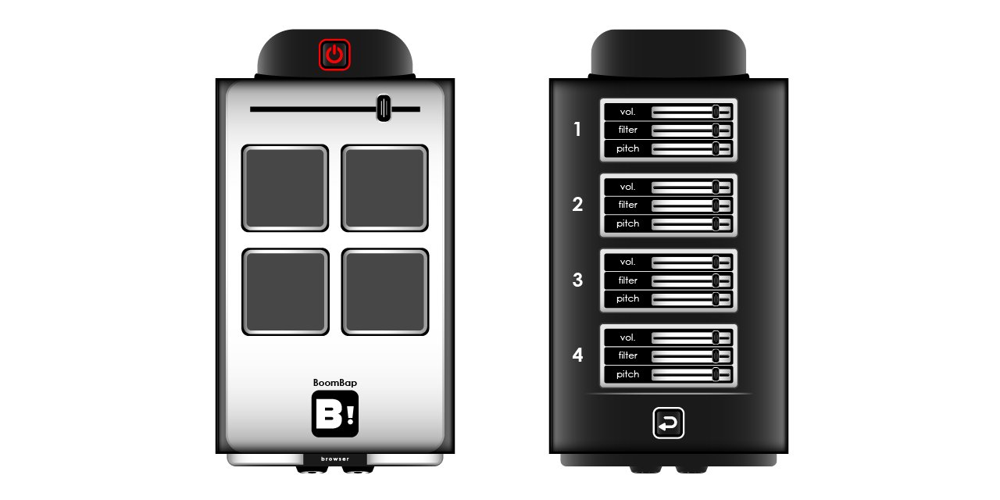

# BoomBapBrowser

***Browser Based Drum Machine***

BoomBapBrowser is a browser based drum machine built with HTML, CSS, and Javascript. The main goal of this project is to explore the [Web Audio API](https://developer.mozilla.org/en-US/docs/Web/API/Web_Audio_API) and build a rudimentary drum sampler application.

### Features
* Power Button
> The power button at the top activates the sampler & also acts as a user gesture to enable sound in browsers.
* Drum Pads
> There are 4 playable drum pads with their own samples: Kick, Snare, HiHat, and Perc.
* Bandpass Filter
> There is a bandpass filter that applies to all samples. The frequency can be changed using the fader at the top of the sampler.
* Settings
> Pressing the settings / gear button will take you to the back panel containing faders/sliders to modify each individual sample. These include volume, filter (low pass) and pitch.

### Keyboard Input
>Pads can be triggered using either the arrow keys or ASDW on a keyboard.

## Live Demo
Try the live demo here: [BoomBapBrowser - Live Demo](https://boombap.2infamouz.com/index.html)

#### Testing Locally
A server is required to bipass CORS restrictions when testing locally.
